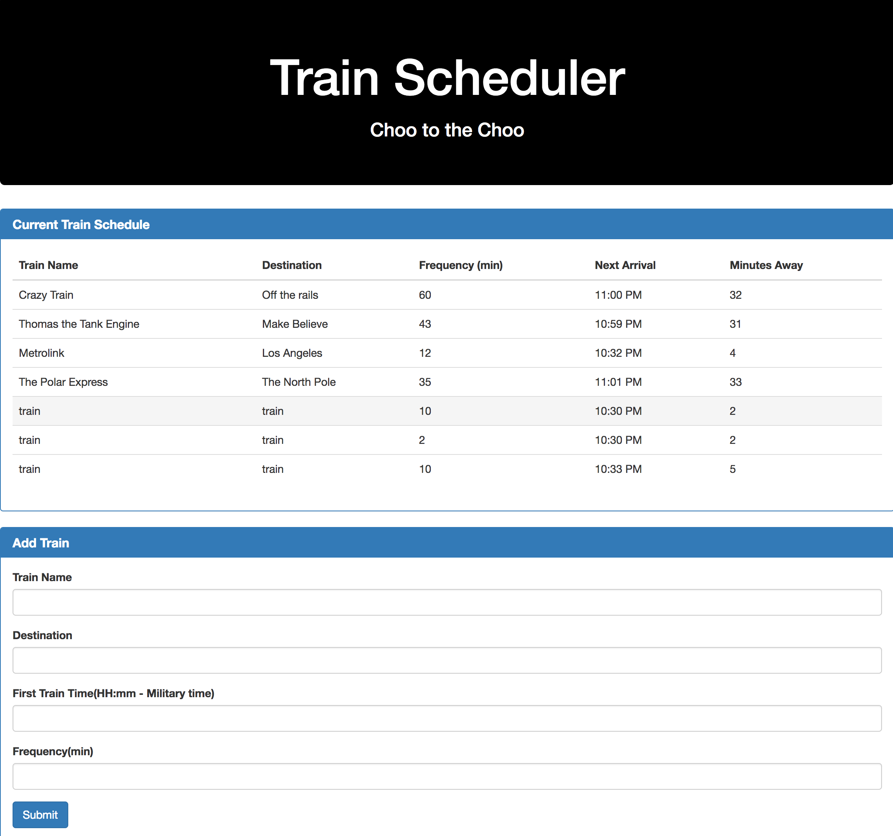

# TrainScheduler
Basic train scheduler website. Input train name, destination, first time train departs and frequency.

Once input is entered and the submit button is clicked.
The next arrivals show up.

tech used:
* HTML
* Bootstrap
* Jquery
* Moment.js
